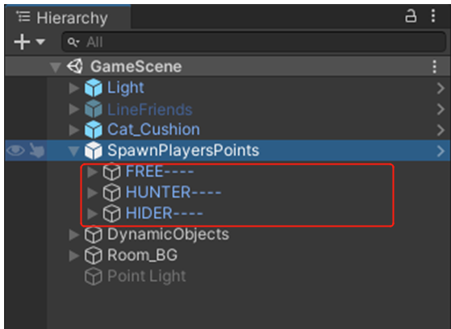
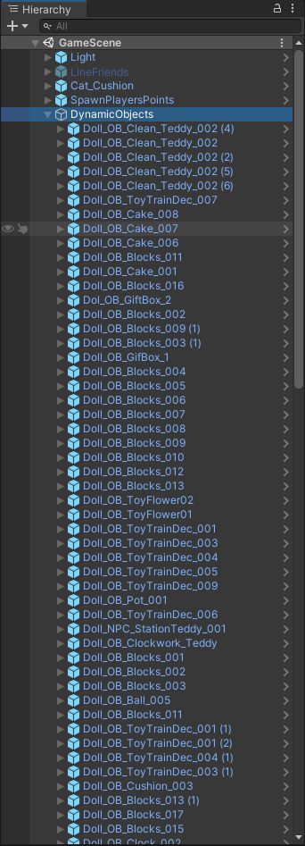
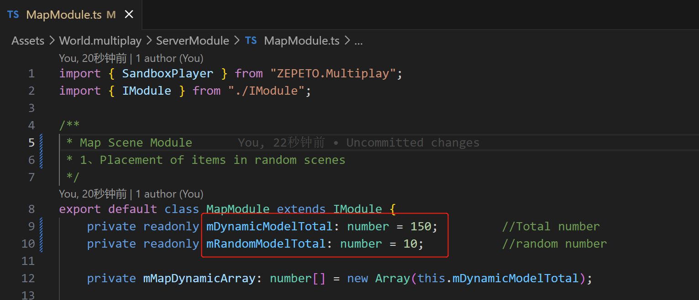
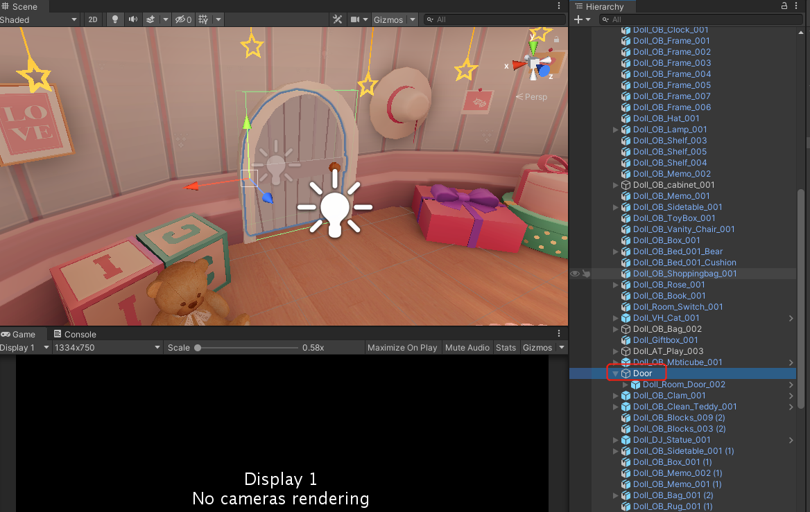
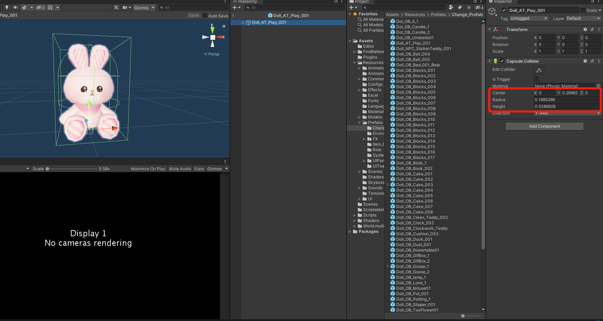
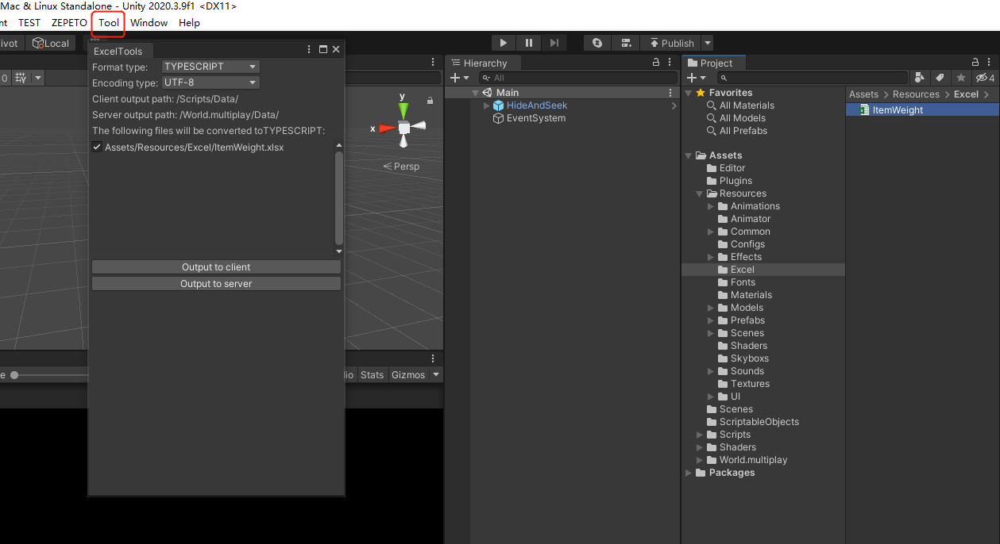

# HideAndSeek_Template

[English](README.md)|[中文]()

# 躲猫猫核心逻辑项目模版

## 项目说明

- 项目中包含躲猫猫玩法的核心逻辑和一个游戏场景（娃娃之家）。
  Main场景为入口，GameScene是动态加载的游戏场景。需要再BuildingSetting中添加这两个场景。
- 运行服务器代码后，直接在Main场景中运行就可以开始游戏。

### 项目配置

- #### 服务器相关配置

ServerData.ts 脚本中的GAME_RULE_JSON中可更改服务器配置相关的参数

- #### 客户端相关配置

1. ##### 出生点配置

在GameScene场景中的SpawnPlayersPoints这个GameObject的子节点下面，创建初始出生点（FREE），躲藏者出生点（HIDER），寻找者出生点（HUNTER）。

2. ##### 场景中动态随机物品配置

在GameScene场景中的DynamicObjects节点下面，创建需要随机动态显示的场景物件。

在MapModule中设置mDynamicModelTotal（物体总数）、mRandomModelTotal（随机个数）。

3. ##### 寻找者出生点处的门

是GameScene场景中的Room_BG/Door物体（名字和节点不能变）。程序中会控制门的开关动画。

4. ##### 躲藏者变身物品的配置

可变身物品的预制体在Assets/Resources/Prefabs/Change_Prefab中。需要单独调整每个预制体上的CapsuleCollider组件的参数，来控制变身模型的碰撞。

Assets/Resources/Excel/ItemWeight 表格控制随机模型的权重。在编辑器的Tool选项下有ExcelTool导表工具，会在Scripts/Data 下生成对应的数据模型。

Assets/ScriptableObjects/ModelImage中配置变身模型关联的icon，id需要和ItemWeight表中的顺序一致。

5. ##### ConfigManager的说明

PlayerInfo.json 中配置了不同阵营角色的速度和相机距离

ModelInfo.json 中只配置了角色默认模型的数据

6. ##### 多语言的配置

在Assets/Scripts/Common/ZW_LOCALIZATION_Peekaboo.csv 中配置

---

### 内置工具说明

- #### ExcelTool

ExcelTool是用来生成对应的数据模型的工具。
在Editor目录下，是工具的脚本。
在Plugins目录下的Excel.dll 和 ICSharpCode.SharpZipLib.dll是工具的依赖库。

- #### 如何使用ExcelTool

打开Tool/ExcelTool，选中需要导出的Excel。设置要导出的文件格式，点击导出到客户端\服务端，会在对应路径下生成文件。
